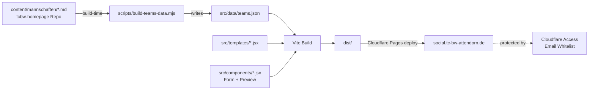
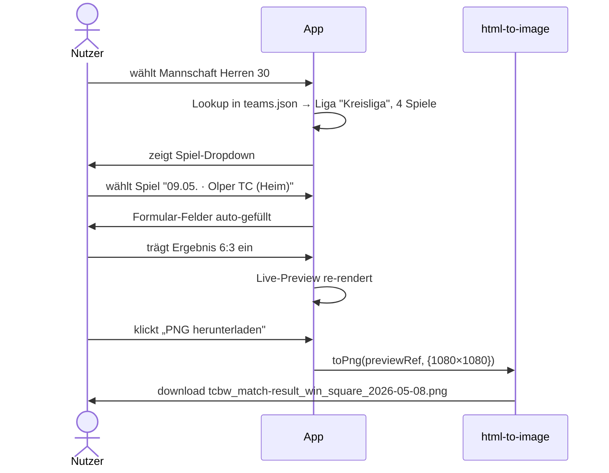

# TC BW Attendorn — Social Media Generator (tcbw-social-tools)

**Status:** Spec — bereit zur Implementierung
**Datum:** 2026-05-08
**Mockup-Stand:** `data/Claude_Design/app-mockup.html` (commit `21faaf6`)

## Ziel

Eine kleine interne Web-App, mit der Vorstandsmitglieder, Mannschaftsführer und Marketing-Verantwortliche **Instagram-fertige Grafiken** für Match-Ergebnisse, Heimspiel-Ankündigungen, Saison-Übersicht und Vereins-Events erzeugen können — **ohne Designer und ohne Tippfehler bei Liganamen oder Gegnern**.

Form-getriebener Workflow: Mannschaft + Spiel + Ergebnis eintragen → Live-Preview → PNG-Download in Square / Portrait / Story.

## Stakeholder

- **Nutzer:** Vorstand TC BW Attendorn (Gerlach, Kersting), Mannschaftsführer:innen (Captains der 7 Teams), Marketing (Paula Kersting).
- **Daten-Owner:** liga.nu (extern, via nuliga-sync auto-aktualisiert)
- **Hosting / Auth:** Cloudflare (gleicher Account wie tcbw-homepage)

## Requirements

### Funktional (MUST)

1. **4 Template-Typen**, alle mit der bestehenden Brand-Sprache (Playfair Display + DM Sans, navy/orange/grün-Akzente, Wappen):
   - **Match-Ergebnis** (Square 1080² / Story 1080×1920) — Varianten *Sieg* / *Niederlage* / *Pokal*
   - **Heimspiel-Ankündigung** (Square / Portrait 1080×1350 / Story) — Varianten *Liga* / *Pokal*
   - **Saison-Übersicht** (Portrait / Story) — alle Mannschaften mit Liga
   - **Event-Card** (Square / Portrait / Story) — Sommerfest, JHV, Arbeitseinsatz
2. **Mannschafts-Dropdown** mit allen 7 Liga-Teams + 2 Pokal-Teams; Auswahl setzt die Liga automatisch (1:1 Lookup).
3. **Spiel-Dropdown** je Mannschaft: zeigt alle Spielplan-Spiele aus liga.nu (Datum, Gegner, Heim/Auswärts). Auswahl füllt Datum + Uhrzeit + Gegner + Heim/Auswärts automatisch.
4. **Heimspiel-Ankündigung** filtert das Spiel-Dropdown auf Heimspiele (CTA „Komm vorbei" passt nicht für Auswärtsspiele).
5. **Pokal-Modus** (Variante = Pokal **oder** Mannschaft = Pokal-Team): Spiel-Dropdown wird ersetzt durch Freitextfelder für Gegner + Datum + Uhrzeit, weil die nächste Pokal-Runde im Spielplan noch nicht steht.
6. **Live-Preview** rechts neben dem Formular, automatisch auf den verfügbaren Platz skaliert (CSS `transform: scale`), aber im DOM weiterhin in voller 1080-px-Auflösung.
7. **PNG-Download** des aktuellen Templates in voller Auflösung (1080-px breit), Dateiname `tcbw_<template>_<variant>_<format>_YYYY-MM-DD.png`.
8. **Reset-Button** in der Stage-Toolbar setzt das Formular auf Default-Werte zurück.

### Funktional (SHOULD)

9. **„Alle Formate auf einmal"-Download** als ZIP — Square + Portrait + Story zusammen, ein Klick. Reduziert Reibung beim Posten in Feed + Story gleichzeitig.
10. **Hugo-Spielplan-Sync:** Build-Script generiert die Mannschaftsdaten (`teams.json`) aus `../tcbw-homepage/content/mannschaften/*.md`, **damit nuliga-sync die einzige Quelle bleibt** und Daten nicht doppelt gepflegt werden müssen.

### Funktional (NICE-TO-HAVE)

11. Eingebauter Mini-Editor für die Mannschaftsliste auf der Saison-Übersicht (für die seltenen Fälle, in denen man eine andere Reihenfolge oder Beschriftung will).
12. „Tageslicht-Modus" — Mockup hat den Light-Mode bereits, Dark-Mode ist nicht vorgesehen.

### Nicht-funktional

- **Bundle-Size:** unter 500 KB gzipped (statisches SPA, kein SSR nötig).
- **Bilder werden client-seitig erzeugt** (`html-to-image`-Library) — keine Server-Komponente, keine Compute-Kosten.
- **Auth:** Cloudflare Access mit Email-Whitelist (kostenlos bis 50 User). Niemand außerhalb der Whitelist kann Posts unter Vereinsbranding generieren.

### Out of Scope

- **Direktes Posten zu Instagram** (Meta Business API, Token-Pflege) — User lädt PNG runter und postet selbst.
- **Story-Animationen / Videos** — nur statische PNGs.
- **Multi-Language** — Deutsch fix.
- **CMS-Integration** für die Templates selbst (Designs werden im Code gepflegt, geänderter Look = neuer Deploy).

## Architektur-Übersicht

**Datenfluss bei Nutzung:**

## Tech Stack

| Schicht | Wahl | Begründung |
|---|---|---|
| Build-Tool | **Vite 5** | schnell, tiny, perfekt für SPAs |
| Framework | **React 18** | Templates sind bereits JSX |
| Sprache | **JavaScript** (kein TypeScript) | Templates sind .jsx, kein TS-Setup nötig — pragmatisch für interne App |
| Styling | **CSS-Variablen** (kein Tailwind) | Bestehendes `colors_and_type.css` 1:1 wiederverwendbar |
| Image Export | **html-to-image** | Im Mockup bewährt, kleine Library, 100 % client-seitig |
| ZIP-Erzeugung | **JSZip** | Falls SHOULD-Requirement #9 implementiert wird |
| Frontmatter Parser (Build-Step) | **gray-matter** | Standard für YAML-Frontmatter aus Markdown |
| Hosting | **Cloudflare Pages** | gleicher Account wie tcbw-homepage, gratis |
| Auth | **Cloudflare Access** | Email-Whitelist, kein Code, gratis bis 50 User |
| Tests (Build-Skript) | **node:test** | Built-in, kein extra-Dep — wie bei `tools/nuliga-sync` |

## Repo-Setup

**Eigenes Repo:** `tcbw-social-tools` auf GitHub (gleiches Org wie tcbw-homepage: `ElGarno`).

**Lokaler Pfad:** `~/PycharmProjects/tcbw-social-tools/` (parallel zu `tcbw-homepage/`).

**Build-time Coupling:** Das Build-Script liest `../tcbw-homepage/content/mannschaften/*.md`. In CI/CD muss das tcbw-homepage Repo als Git-Submodule oder per `actions/checkout` zusätzlich ausgecheckt werden. Lokal: einfach beide Repos parallel klonen.

> **Alternative für später:** Hugo-Site stellt `/api/teams.json` als Build-Output bereit; Social-Tools-Build holt sich das per `fetch()`. Aktuell: Cross-Repo Checkout.

## Deployment-Workflow

1. **Lokale Entwicklung:** `npm run dev` (Vite-Server auf `:5173`).
2. **Build:** `npm run build` → `dist/` Ordner. Build-Script läuft als `prebuild`-Hook und regeneriert `src/data/teams.json` aus `../tcbw-homepage/content/mannschaften/*.md`.
3. **Deploy:** GitHub Push auf `main` → Cloudflare Pages baut auto. Build-Command in CF Pages: `npm run build`. Output-Verzeichnis: `dist`.
4. **Domain:** Sub-Domain `social.tc-bw-attendorn.de` (CNAME auf CF Pages).
5. **Auth-Setup (einmalig im CF-Dashboard):**
   - Cloudflare Zero Trust → Access → Applications → „Add application" (Self-hosted)
   - Domain: `social.tc-bw-attendorn.de`
   - Policy: „Emails on whitelist" (z.B. `vorstand@…`, `bastian.gerlach@…`, etc.)
6. **Daten-Aktualität:** nuliga-sync läuft täglich → MDs in tcbw-homepage werden auto-aktualisiert → nächster Social-Tools-Build greift neue Daten. Wenn ein Spielplan sich ändert, deployt Social-Tools beim nächsten manuellen Build neu (kein automatischer Trigger nötig — die Daten ändern sich selten relevant für Posts).

## Branding & Voice

Identisch zur Hauptseite (siehe `data/Claude_Design/SKILL.md`):

- Headlines: **Playfair Display 700**, `letter-spacing: -0.02em`
- Body: **DM Sans 400/500**, `line-height: 1.6`
- Eyebrow: **DM Sans 600**, UPPERCASE, `letter-spacing: 0.18em`, in `--blue-500`
- Primary CTA: `--blue-600` (#1a4080), white text, `--shadow-cta`
- Hero/Card-Backgrounds: `linear-gradient(160deg, --blue-700 → --blue-900)` mit Court-Lines + Foto
- Voice: Deutsch, **du/ihr** (informal). „Blau-Weiss" mit Doppel-S.
- Emoji-Budget: ein 🎾 pro Card maximum. Nicht mehr.

## Erfolgskriterien

| Kriterium | Messbar |
|---|---|
| **Time-to-Post unter 60 Sekunden** | Nach Mannschaftsauswahl → Spielauswahl → Score → Download in <1min |
| **Null Tippfehler in Liga/Gegnernamen** | Dropdown-Werte = liga.nu canonical form, kein Freitext (außer Pokal) |
| **Keine doppelte Datenpflege** | Spielpläne werden nur in `content/mannschaften/*.md` gepflegt; Social-Tools liest nur |
| **Kein Login-Reibung** | Cloudflare Access mit „One-Time Pin"-Email — User kennt eigene Adresse |
| **Bundle <500 KB gzipped** | Lighthouse-Check |
| **Funktioniert offline nach erstem Load** | PNG-Generierung 100 % client-seitig (Service-Worker optional) |

## Offene Fragen / Risiken

1. **Wer pflegt die Email-Whitelist** in Cloudflare Access? — Vorschlag: Fabian (Digitales-Ressort) als CF-Account-Admin.
2. **Was passiert bei Datenstand-Drift** (Mannschaft umbenannt, neue Pokal-Mannschaft)? — Build-Script muss robust sein gegen unbekannte Mannschaften, sonst bricht der Build.
3. **Sollen alte Posts gespeichert werden?** — Aktuell nein. Wenn jemand denselben Post nochmal posten will, muss er Werte erneut eingeben. Falls später gewünscht: localStorage als Draft-Speicher.
4. **Was wenn liga.nu mal down ist beim Build?** — Irrelevant: Build liest nur lokale MDs (die wurden vorher von nuliga-sync committet).

## Referenzen

- Mockup: `data/Claude_Design/app-mockup.html` (Stand commit `21faaf6`)
- Templates (Source of Truth): `data/Claude_Design/templates.jsx`, `templates-events.jsx`
- Brand-Skill: `data/Claude_Design/SKILL.md`
- Mannschafts-Daten: `content/mannschaften/*.md`
- nuliga-sync (Daten-Pipeline): `tools/nuliga-sync/`, Spec `doc/specs/2026-04-20-nuliga-sync-workflow.md`
